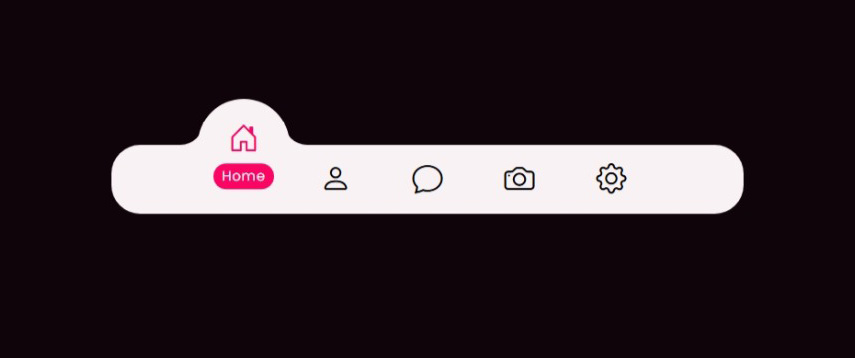

# 📱 Floating Navigation Bar

> _A soft, floating navigation bar with smooth motion and minimalist bubble indicator._

A **clean, modern navigation bar** designed with a **floating bubble indicator** that moves seamlessly between items.
This project refines the concept from the “Magic Navigation Series,” blending **precision animation**, **subtle elevation**, and **lightweight UI motion**.
Built purely with **HTML, CSS, and Vanilla JavaScript** — minimal yet expressive.

🔗 **[Live Demo](https://nsnet21.github.io/11-floating-navigation-bar/)**

---

## 🖼️ Preview



---

## 🚀 Features

### 🔵 Floating Bubble Indicator

- Circular **indicator** moves smoothly to follow the active item.
- Uses **`::before` and `::after`** pseudo-elements to shape curved edges dynamically.
- Mimics a “bubble rise” effect by adjusting `top` and `translateY` transitions.

### 💡 Soft Motion Design

- Animated using **CSS transitions (0.5s ease)** for gentle visual flow.
- Active icon **rises up** while its label fades in below the bubble.
- Combined hover and active states create layered depth.

### 🎨 Modern Color System

- Core palette based on:
  - **Razzmatazz pink** accent (`--accent`, `--razzmatazz-*`)
  - **Diesel gray** background tones (`--diesel-*`)
- Built fully with **CSS variables**, easy to recolor or theme switch.
- Balanced dark background contrast for elegant visual hierarchy.

### 🧭 Responsive & Clean Layout

- Each icon section sized precisely (`80px`) for perfect spacing.
- Auto-aligns with the floating indicator through sibling combinator `~`.
- No text overflow or positioning hacks — fully flexible via `flexbox`.

---

## 💻 Tech Stack

| Area          | Tech Used                                                                                                              |
| ------------- | ---------------------------------------------------------------------------------------------------------------------- |
| Structure     | HTML5                                                                                                                  |
| Styling       | CSS3 (Variables, Flexbox, Transitions, Pseudo-elements)                                                                |
| Interactivity | Vanilla JavaScript                                                                                                     |
| Icons         | [Bootstrap Icons](https://icons.getbootstrap.com/)                                                                     |
| Fonts         | [Poppins](https://fonts.google.com/specimen/Poppins), [Noto Serif JP](https://fonts.google.com/specimen/Noto+Serif+JP) |

---

## 🧩 How It Works

### 🔹 JS Active Link Controller

```js
const list = document.getElementsByClassName("list");

function addActive() {
  for (let i = 0; i < list.length; i++) {
    const isActive = this.classList.contains("active");
    if (!isActive) {
      for (let j = 0; j < list.length; j++) list[j].classList.remove("active");
      this.classList.add("active");
    }
  }
}

for (let i = 0; i < list.length; i++) {
  list[i].addEventListener("click", addActive);
}
```

➡ Ensures only one icon stays active — and synchronizes movement of the `.indicator`.

---

### 🔸 Indicator Transition Logic

```css
.navigation ul li:nth-child(3).active ~ .indicator {
  transform: translateX(calc(80px * 2));
}
```

---

### 🔸 Active State Animation

```css
.navigation ul li.active a .icon {
  transform: translateY(-35px);
  color: var(--accent);
}
.navigation ul li.active a .text {
  opacity: 1;
  transform: translateY(-3px);
}
```

The icon lifts upward, and a glowing pink text bubble (“Home”) gently appears beneath.

---

## 🧱 Folder Structure

```
11Floating-Navigation-Bar/
│
├── assets-preview/
│   └── preview.jpg
│
├── images/
│
├── index.html
├── style.css
├── script.js
├── README.md
└── .gitignore
```
## 📖 Learning Focus

- Refine **indicator animation logic** using sibling selectors.
- Perfect **floating motion & easing** for natural feel.
- Explore **pseudo-elements for dynamic shape building**.
- Master **color harmony** between accent and base tones.
- Create a **clean, minimal floating bar** suitable for mobile or web UI.

---

**Designed & coded** by [_**Nate**_](https://github.com//NSNet21)

💡 “Lightweight, minimal, and floating with purpose.”
